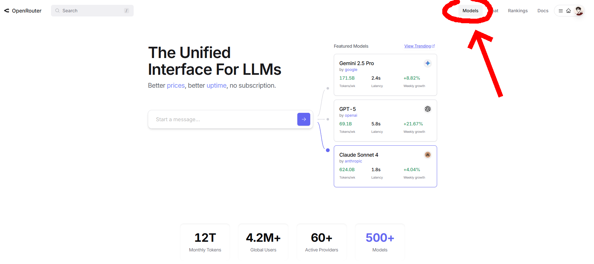
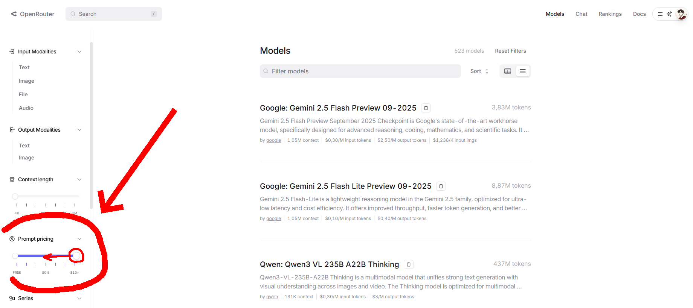
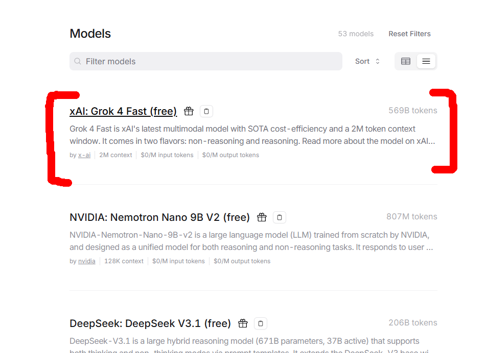
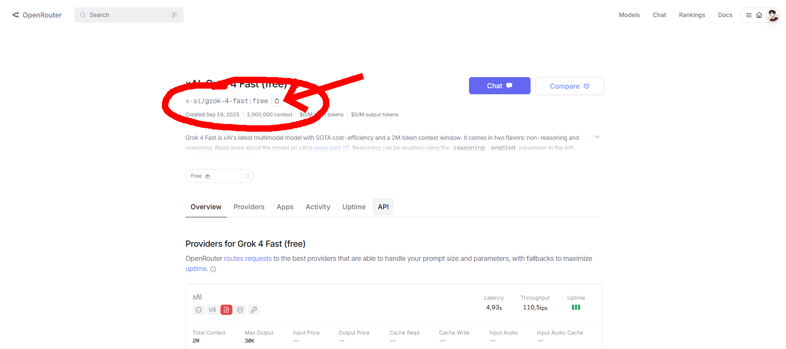
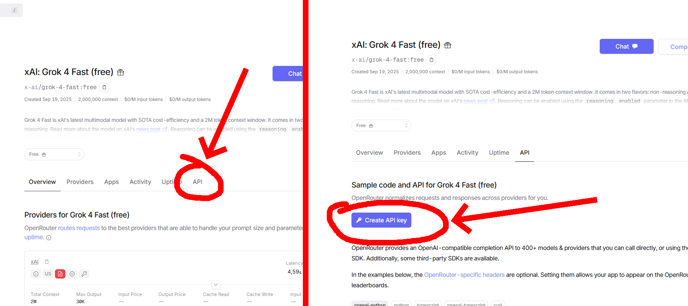
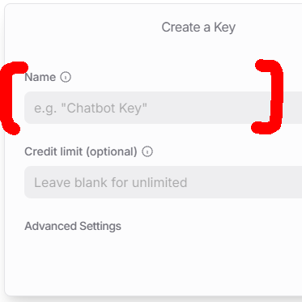

# Cognix ⌨️
### Deep thinker keyboard v0.1

Teclado com integração a IA via Token, open source rodando **raspberry pi zero 2 w** com capacidade de leitura de arquivos no Pc conectado e rodar codigos no geral

---

## Passos
**Baixe as dependencias** 
- Python 3.x
- Requests `pip install requests`
- Conta no [OpenRouter](https://openrouter.ai) AI e API Key

## Executar o projeto

Antes de rodar o script, você precisa criar sua **API Key** no OpenRouter e escolher o modelo da IA:

1. Acesse o site do [OpenRouter](https://openrouter.ai) e faça uma conta.
   
2. Vá na aba **Models** 
 
3. Filtre pelo valor da IA para selecionar apenas **gratuitas** 
   
4. Escolha a IA desejada 
   e copie o link do modelo da IA 
   - Guarde este link para usar depois
     
6. Clique no botão **API** da IA e depois em **Create API Key** 
   - Preencha o nome da chave e clique em **Create**
      
   - ⚠️ **! ATENÇÃO**: salve sua API Key agora, pois **não será possível visualizá-la novamente**

7. Abra o código do projeto no Visual Studio (ou outro editor de sua preferência).
   
8. Substitua no código:
   ```python
   "Authorization": "Bearer TOKEN AQUI"       # coloque sua API Key
   "model": "MODELO AQUI"                     # cole o link do modelo da IA


```bash
py app.py

```
<p align="center">  </p>
